1. Создание виртуальной машины
Создать виртуальную машину Ubuntu 22.04 в VMware Workstation Player. В качестве названия виртуальной машины, имени пользователя Ubuntu и hostname использовать свою фамилию в транслите (например, студент Иванов → имя ВМ ivanov, пользователь ivanov, hostname ivanov). Приглашение терминала после установки должно выглядеть как ivanov@ivanov:~$.

Скриншоты:

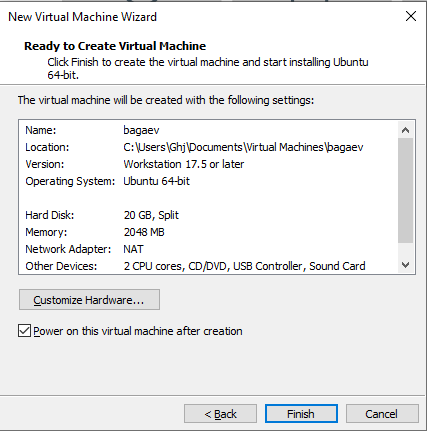

2. Информация о системе
Выполнить команды и сохранить вывод в файл ~/report/01-system.txt:
mkdir -p ~/report
echo '=== СИСТЕМА ===' > ~/report/01-system.txt
uname -a >> ~/report/01-system.txt
echo '' >> ~/report/01-system.txt
echo '=== ОС ===' >> ~/report/01-system.txt
cat /etc/os-release >> ~/report/01-system.txt
echo '' >> ~/report/01-system.txt
echo '=== ПРОЦЕССОР ===' >> ~/report/01-system.txt
lscpu | head -15 >> ~/report/01-system.txt
echo '' >> ~/report/01-system.txt
echo '=== ПАМЯТЬ ===' >> ~/report/01-system.txt
free -h >> ~/report/01-system.txt
echo '' >> ~/report/01-system.txt
echo '=== ДИСКИ ===' >> ~/report/01-system.txt
df -h >> ~/report/01-system.txt

Скриншоты:

3. Сеть: IP-адрес и открытые порты
Выполнить команды и сохранить в ~/report/02-network.txt:
echo '=== IP-АДРЕСА ===' > ~/report/02-network.txt
ip addr show >> ~/report/02-network.txt
echo '' >> ~/report/02-network.txt
echo '=== ОТКРЫТЫЕ ПОРТЫ ===' >> ~/report/02-network.txt
sudo ss -tlnp >> ~/report/02-network.txt

Скриншоты:

4. Сервис SSH
Проверить статус сервиса SSH и определить его порт. Сохранить в ~/report/03-ssh.txt:
echo '=== СТАТУС SSH ===' > ~/report/03-ssh.txt
sudo systemctl status ssh >> ~/report/03-ssh.txt 2>&1
echo '' >> ~/report/03-ssh.txt
echo '=== ПОРТ SSH ===' >> ~/report/03-ssh.txt
sudo ss -tlnp | grep ssh >> ~/report/03-ssh.txt

Скриншоты:

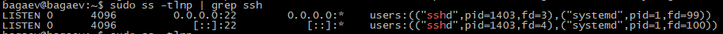
5. Пользователи и группы
Вывести информацию о пользователях и группах. Создать пользователя boardy, добавить в группу sudo. Сохранить в ~/report/04-users.txt:
echo '=== ТЕКУЩИЙ ПОЛЬЗОВАТЕЛЬ ===' > ~/report/04-users.txt
whoami >> ~/report/04-users.txt
id >> ~/report/04-users.txt
echo '' >> ~/report/04-users.txt
echo '=== ПОЛЬЗОВАТЕЛИ С BASH ===' >> ~/report/04-users.txt
grep '/bin/bash' /etc/passwd >> ~/report/04-users.txt
echo '' >> ~/report/04-users.txt
echo '=== ВСЕ ПОЛЬЗОВАТЕЛИ ===' >> ~/report/04-users.txt
cut -d: -f1 /etc/passwd | sort >> ~/report/04-users.txt
echo '' >> ~/report/04-users.txt
echo '=== ГРУППЫ ===' >> ~/report/04-users.txt
groups >> ~/report/04-users.txt

Затем создать пользователя и проверить:
sudo adduser boardy
sudo usermod -aG sudo boardy
id boardy

Скриншоты:

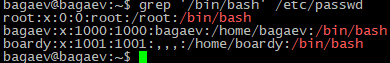
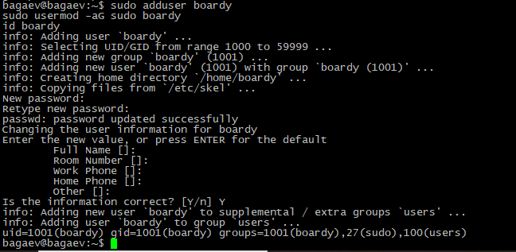
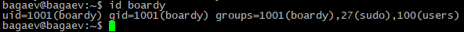
6. Дерево каталогов
Изучить структуру файловой системы. Сохранить в ~/report/05-tree.txt:
echo '=== КОРЕНЬ ===' > ~/report/05-tree.txt
ls -la / >> ~/report/05-tree.txt
echo '' >> ~/report/05-tree.txt
echo '=== /home ===' >> ~/report/05-tree.txt
ls -la /home >> ~/report/05-tree.txt
echo '' >> ~/report/05-tree.txt
echo '=== ДОМАШНИЙ КАТАЛОГ ===' >> ~/report/05-tree.txt
ls -la ~ >> ~/report/05-tree.txt

Скриншоты:

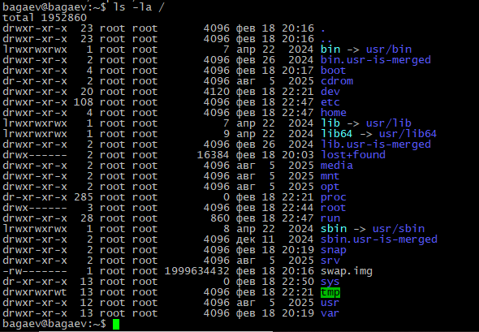

7. Права доступа
Посмотреть права на ключевые каталоги и изменить права на тестовом файле. Сохранить в ~/report/06-permissions.txt:
echo '=== ПРАВА НА КАТАЛОГИ ===' > ~/report/06-permissions.txt
ls -ld / /etc /var /tmp /home >> ~/report/06-permissions.txt
echo '' >> ~/report/06-permissions.txt
echo '=== ИЗМЕНЕНИЕ ПРАВ ===' >> ~/report/06-permissions.txt
touch ~/report/testfile.txt
ls -l ~/report/testfile.txt >> ~/report/06-permissions.txt
chmod 755 ~/report/testfile.txt
ls -l ~/report/testfile.txt >> ~/report/06-permissions.txt
chmod 600 ~/report/testfile.txt
ls -l ~/report/testfile.txt >> ~/report/06-permissions.txt

Скриншоты:

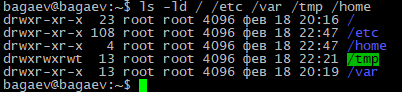

8. Установленные пакеты и сервисы
Посмотреть ключевые пакеты и запущенные сервисы. Сохранить в ~/report/07-packages.txt:
echo '=== КЛЮЧЕВЫЕ ПАКЕТЫ ===' > ~/report/07-packages.txt
dpkg -l | grep -E 'openssh|python|git|curl|vim|nano' >> ~/report/07-packages.txt
echo '' >> ~/report/07-packages.txt
echo '=== КОЛИЧЕСТВО ПАКЕТОВ ===' >> ~/report/07-packages.txt
dpkg -l | grep '^ii' | wc -l >> ~/report/07-packages.txt
echo '' >> ~/report/07-packages.txt
echo '=== ЗАПУЩЕННЫЕ СЕРВИСЫ ===' >> ~/report/07-packages.txt
systemctl list-units --type=service --state=running >> ~/report/07-packages.txt

Скриншоты:

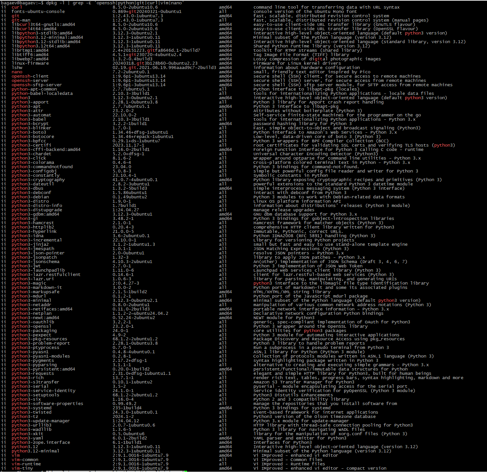

9. Конвейер и перенаправление
Выполнить комплексные команды с конвейерами. Сохранить в ~/report/08-pipes.txt:
echo '=== ТОП-10 ПРОЦЕССОВ ПО ПАМЯТИ ===' > ~/report/08-pipes.txt
ps aux --sort=-%mem | head -11 >> ~/report/08-pipes.txt
echo '' >> ~/report/08-pipes.txt
echo '=== ПРОЦЕССЫ ПО ПОЛЬЗОВАТЕЛЯМ ===' >> ~/report/08-pipes.txt
ps aux | tail -n +2 | awk '{print $1}' | sort | uniq -c | sort -rn >> ~/report/08-pipes.txt
echo '' >> ~/report/08-pipes.txt
echo '=== БОЛЬШИЕ ФАЙЛЫ В /var ===' >> ~/report/08-pipes.txt
sudo du -ah /var 2>/dev/null | sort -rh | head -10 >> ~/report/08-pipes.txt

Скриншоты:

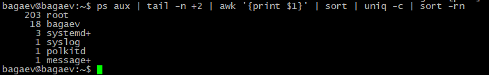
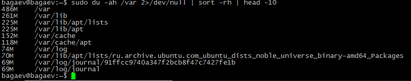
10. Итоговый файл
Собрать все файлы в один и проверить:
cat ~/report/0*.txt > ~/report/FULL-REPORT.txt
wc -l ~/report/FULL-REPORT.txt
ls -lh ~/report/

Скриншоты:

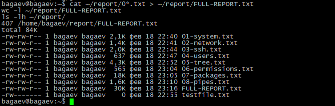